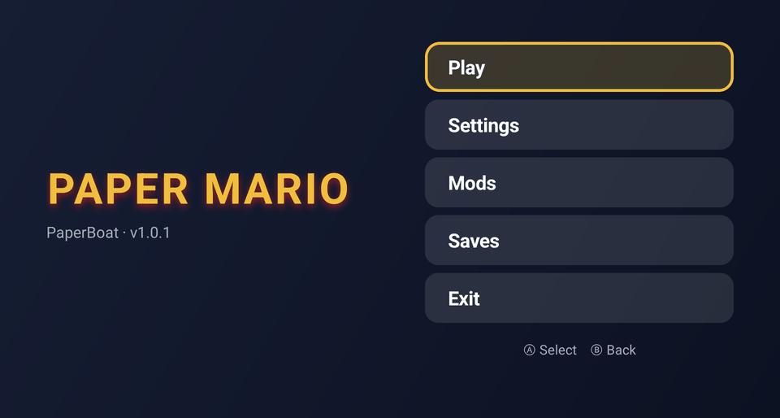
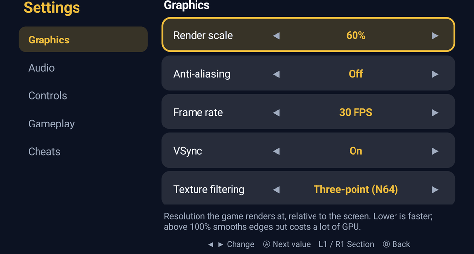
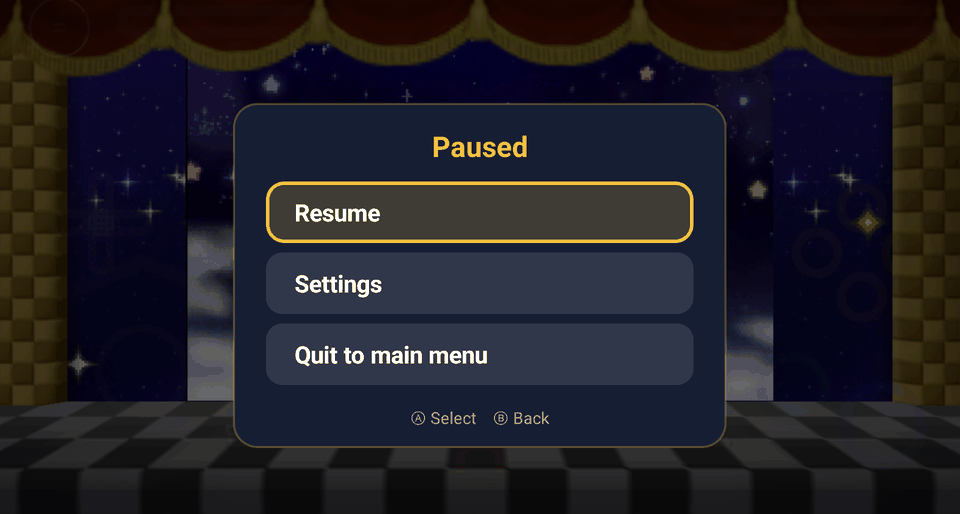
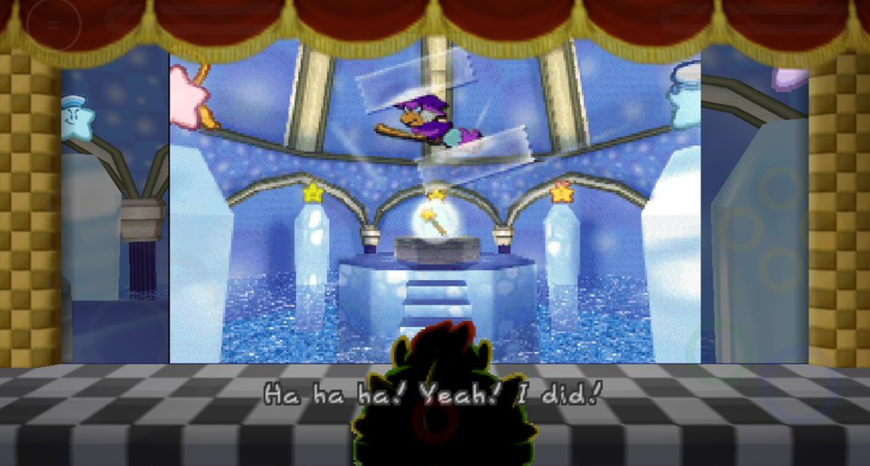

# PaperBoat
*Harbour Masters port of Paper Mario 64*

## Android build (this fork)

This fork makes PaperBoat play well on Android handhelds: it fixes the bugs that
broke the upstream Android build and adds a menu you can drive entirely with a
controller or by touch. It was developed and tested on a **Mangmi Air X**
(Android 14, Snapdragon 662 / Adreno 610). Upstream is
[HarbourMasters/PaperBoat](https://github.com/HarbourMasters/PaperBoat); everything
from **Project Lead** down is their README, unchanged.

| Main menu | Settings |
| :---: | :---: |
|  |  |
| **Pause menu (Back twice)** | **In game** |
|  |  |

### What's different from upstream

**Fixes**
- **Crash on first launch** after extracting the ROM (the app asked the engine
  about its menu before the engine existed).
- **Settings never saved** on Android (the config path contained the app
  directory twice).
- **Garbled or black graphics on Adreno GPUs.** Two causes, both needed:
  GLES shaders now use `highp` precision (in the
  [libultraship fork](https://github.com/chris43123/libultraship/tree/airx)), and
  Android's native heap pointer tagging is turned off.
- **Signed `char`** on AArch64, matching every other platform the port builds for.

**New**
- **Main menu**: Play, Settings, Mods, Saves and Exit, instead of dropping
  straight into the game. Opening the app while a game is running offers
  **Resume**.
- **Native settings**: render scale, anti-aliasing, frame rate, VSync, texture
  filtering, full-height view, volumes, touch controls, gameplay options and
  cheats, written straight to the engine's `paperboat.cfg.json`.
- **Pause menu**: press **Back twice** in game for Resume, Settings or Quit to
  main menu. The game really pauses while it's open.
- **Quitting** now always returns to the main menu.

### Install

There is no prebuilt APK yet, so build it yourself. You need the Android SDK
with **NDK 30.0.15729638**, **CMake 3.30.3+** from the SDK manager, and
**JDK 17+** (details in [docs/android-ios-web.md](docs/android-ios-web.md#android)).

```bash
git clone --recursive -b airx https://github.com/chris43123/PaperBoat.git
cd PaperBoat/android
./gradlew assembleRelease        # app/build/outputs/apk/release/app-release.apk
adb install -r app/build/outputs/apk/release/app-release.apk
```

The build is for 64-bit ARM (`arm64-v8a`), which covers current Android handhelds.
Without your own signing key it's signed with the debug key; that installs fine,
but you'd have to uninstall it before installing a build signed differently.

### First run

1. Open **Paperboat** and pick your own **Paper Mario (USA)** ROM when asked
   (SHA-1 `3837f44cda784b466c9a2d99df70d77c322b97a0`). No game data ships with the app.
2. The game assets are extracted on the device. This happens once and takes about a
   minute; keep the app open until the main menu appears.

### Controls in the menus

| Input | Main menu / pause menu | Settings |
| --- | --- | --- |
| D-pad | Move | Up/down: move · Left/right: change value |
| **A** | Select | Next value |
| **B** / Back | Back | Back (changes are already saved) |
| **L1 / R1** | — | Previous / next section |
| Touch | Tap a button | Tap ◀ ▶, a row, or a section name |

Settings only change while the game is closed, since the running game would
overwrite them. The pause menu's **Settings** closes the game for you and opens
the settings screen. Anything since your last in-game save is lost when the
game closes, and both Settings and Quit ask first.

The engine's own menu (the ☰ button in the top-left) is still there for
everything not covered by the native screens.

### Files on the device

Everything lives in `Android/data/dev.net64.paperboat/files/`:

| Path | What |
| --- | --- |
| `paperboat.cfg.json` | All settings |
| `saves/` | Save files (also managed from **Saves** in the main menu) |
| `mods/` | `.o2r` / `.zip` mods (also managed from **Mods**) |
| `pm64.o2r` | Assets extracted from your ROM |
| `logs/Paperboat.log` | The engine's log, useful for bug reports |

### Known limitations

- Tested on one device so far (Mangmi Air X). Other 64-bit ARM Android handhelds
  should work, but reports are welcome.
- The on-screen touch controls are on by default; turn them off in
  **Settings → Controls** if you only use physical buttons.
- On weaker chips, lower **Render scale** and leave anti-aliasing off if the
  game stutters.

---

Project Lead:
* Caladius

Developers:
* Bass3l
* JeodC
* Caladius
* KiritoDv

## Website & Discord
Official Website: https://www.harbourmasters.org/

Official Discord: https://discord.gg/harbourmasters

*If you're having any trouble after reading through this `README`, feel free ask for help in the PaperBoat text channels. Please keep in mind that we do not condone piracy.*

# Quick Start

PaperBoat does not include any copyrighted assets.  You are required to provide a supported copy of the game.

### 1. Verify your ROM dump
US SHA1 Hash: `3837f44cda784b466c9a2d99df70d77c322b97a0`
You can verify you have dumped a supported copy of the game by using the compatibility checker at https://paperboat.equipment/.

### 2. Download PaperBoat from [Releases](https://github.com/HarbourMasters/PaperBoat/releases)

### 3. Launch the Game!
#### Windows
* Extract the zip
* Launch `paperboat.exe`

#### Linux
* Place your supported copy of the game in the same folder as the appimage.
* Execute `paperboat.appimage`. You may have to `chmod +x` the appimage via terminal.

#### macOS
* Run `paperboat.app`.
* When prompted, select your supported copy of the game.

### 4. Play!

Congratulations, you are now sailing with PaperBoat! Have fun!

# Configuration

### Default keyboard configuration
| N64 | A | B | Z | Start | Analog stick | C buttons | D-Pad |
| - | - | - | - | - | - | - | - |
| Keyboard | X | C | Z | Space | WASD | Arrow keys | TFGH |

### Other shortcuts
| Keys | Action |
| - | - |
| Esc | Toggle menubar |
| F11 | Fullscreen |
| Tab | Toggle Alternate assets |
| Ctrl+R | Reset |

### Graphics Backends
Currently, there are three rendering APIs supported: DirectX 11 (Windows), OpenGL (all platforms), and Metal (macOS). You can change which API to use in the `Settings` menu of the menubar, which requires a restart.

If you're having an issue with crashing, you can also change the API manually in the `paperboat.cfg.json` file by finding the `"Backend": {` section and updating the backend ID and name. Be sure to use one of the valid values:

- `0` = DirectX 11 (default on Windows)
- `1` = OpenGL
- `2` = Metal (default on macOS)

# Custom Assets

Custom assets are packed in `.o2r` or `.otr` files. To use custom assets, place them in the `mods` folder.

If you're interested in creating and/or packing your own custom asset `.o2r`/`.otr` files, check out the following tools:
* [**retro - OTR and O2R generator**](https://github.com/HarbourMasters64/retro)
* [**fast64 - Blender plugin (Note that PM64 is not fully supported at this time)**](https://github.com/HarbourMasters/fast64)

# Development

### Building
If you want to manually compile PaperBoat, please consult the [building instructions](docs/BUILDING.md).

### Playtesting
If you want to playtest a continuous integration build, you can find them at the links below. Keep in mind that these are for playtesting only, and you will likely encounter bugs and possibly crashes.

* [Windows](https://nightly.link/HarbourMasters/PaperBoat/workflows/build/develop/Paperboat-windows.zip)
* [macOS](https://nightly.link/HarbourMasters/PaperBoat/workflows/build/develop/Paperboat-mac.zip)
* [Linux](https://nightly.link/HarbourMasters/PaperBoat/workflows/build/develop/Paperboat-linux.zip)

<a href="https://github.com/Kenix3/libultraship/">
  <picture>
    <source media="(prefers-color-scheme: dark)" srcset="./docs/poweredbylus.darkmode.png">
    
  </picture>
</a>

# Special Thanks:

This wouldn't have been possible without your amazing work:

* [The Paper Mario decomp team](https://github.com/pmret/papermario)
* [The Paper Mario DX team](https://github.com/bates64/papermario-dx)
